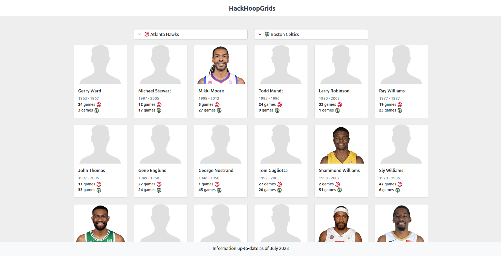

# HackHoopGrids

This is a web application developed in Python using the Flask framework. It connects to a SQLite database and allows users to select two NBA teams and view players who have played on both teams. The application presents data up to July 2023.

Try it out here: [http://jlozanoredondo.pythonanywhere.com/](http://jlozanoredondo.pythonanywhere.com/)

## How to Run the Application

### Prerequisites

Before you can run the application, make sure that you have installed:

- [Python 3.9+](https://www.python.org/)
- [Flask](https://flask.palletsprojects.com/)
- [SQLite](https://www.sqlite.org/index.html)

### Steps

1. Clone the repository or download the ZIP file and extract it.
2. Navigate to the repository folder from the terminal.
3. Install the required dependencies with `pip install -r requirements.txt`.
4. Run the application with `python app.py`.
5. Open a web browser and navigate to `http://127.0.0.1:5000`.

## How to Contribute

Contributions are always welcome! Please read our contributing guidelines before you start.
